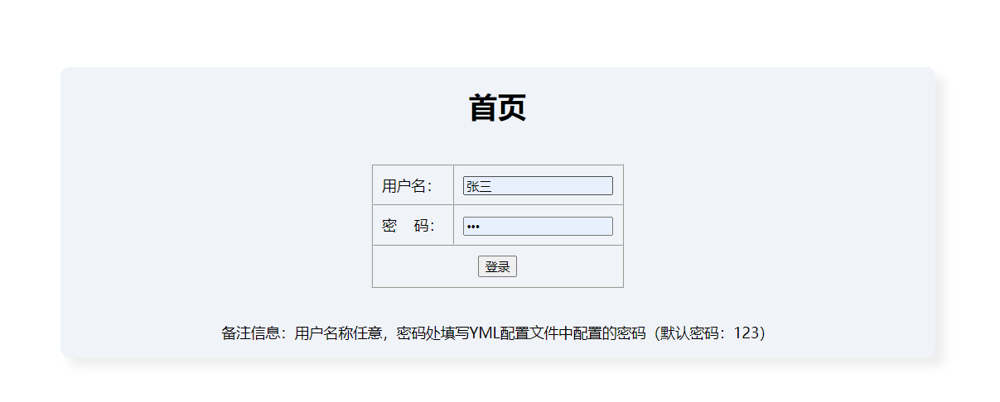
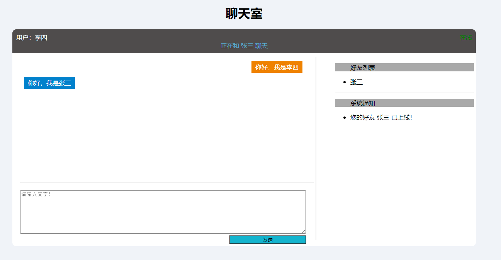

# 使用教程
本项目只是一个Demo，不足之处请谅解。

## 1.环境
IDEA 2021<br>
JDK 1.8<br>

## 2.配置登录密码
修改application.yml文件中的如下节点：
```yaml
login: 
 test: 
  password: 登录密码
```
此密码作为测试用，账户名称可以随便填写，只要密码和yml文件种配置的一致，就能登录成功。
## 3.启动项目.
运行启动器类（WebsocketChatroomApplication）启动项目
## 4.浏览器访问
分别用<font color="#FF0000">不同的浏览器登录不同的用户</font>；因为没有做重复登录验证，
使用同一个浏览器登录，会导致不同的用户登录后会共用一个httpsession,会产生发送的消息接收异常。<br>
默认访问地址是：http://localhost:8080
## 5.示例图




## 6. 参考教程
https://www.bilibili.com/video/BV1r54y1D72U/
